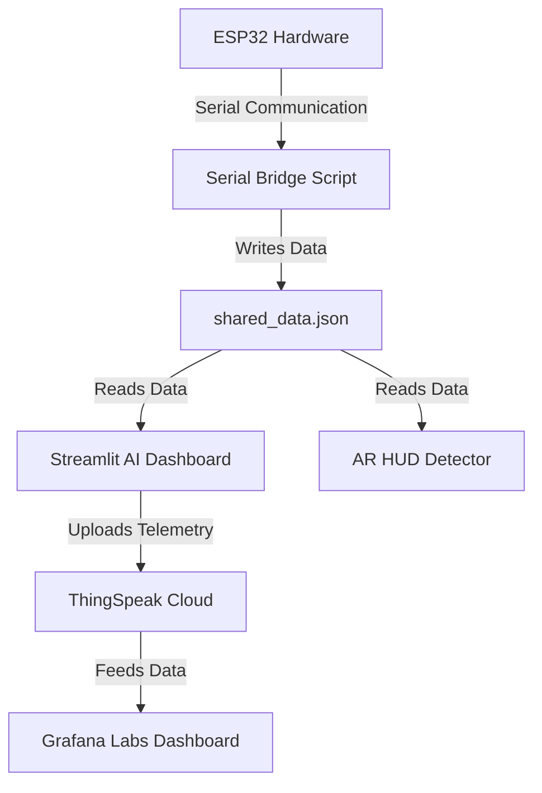

# Machine Health Monitoring System — Project Explanation

This project implements a multi-modal, end-to-end **Predictive Maintenance and Machine Health Monitoring System**. It leverages hardware sensors (via ESP32), local machine learning models (PyTorch & Scikit-Learn), real-time visualization (Streamlit dashboard & AR detector), and cloud analytics (ThingSpeak & Grafana Labs).

---

## 1. System Architecture

The overall pipeline of the system is structured as follows:



1. **ESP32 Node**: Reads real-time data from sensors (MLX90614 Infrared Temperature Sensor, ACS712 Current Sensor) and communicates over serial to the PC.
2. **Serial Bridge (`serial_bridge.py`)**: Reads, parses, and buffers the raw telemetry and vibration data. It then writes it to `shared_data.json`.
3. **Streamlit AI Dashboard (`dashboard.py`)**: Reads the live JSON file, feeds the metrics to the local machine learning models for real-time predictions, updates visualizations, and syncs the data to the cloud.
4. **AR HUD Detector (`detector.py`)**: Runs OpenCV-based computer vision tracking to display a real-time Augmented Reality overlay on top of the machinery.
5. **ThingSpeak Cloud & Grafana Labs**: Serves as the cloud backend, storing historic feeds and providing state-of-the-art telemetry visualization from anywhere in the world.

---

## 2. Multi-Modal Machine Learning Architecture

The core AI engine uses a **late-fusion model** architecture to achieve high diagnostic reliability:

```
                  ┌───────────────┐
vibration buffer ─┤  1D-CNN (Py)  ├─► cnn_prob ─┐
                  └───────────────┘             │   ┌─────────────────────┐
                                                ├──►│ Logistic Regression ├─► FUSED STATUS
                  ┌───────────────┐             │   │    (Meta-Learner)   │
 telemetry data  ─┤ Random Forest ├─► rf_prob  ─┘   └─────────────────────┘
                  └───────────────┘
```

### A. Vibration Branch (PyTorch 1D-CNN)
- **Model**: [HealthMonitor1DCNN](file:///c:/Users/deepa/OneDrive/Desktop/ELP2/model_utils.py#L42-L86)
- **Purpose**: Classifies complex physical vibration signals. It processes a sliding window of $100 \times 3$ vibration channels.
- **Why Convolutional**: Conv1D filters extract local micro-patterns (e.g. bearing defect frequencies and impact spikes) directly from the raw time-series data.

### B. Telemetry Branch (Scikit-Learn Random Forest)
- **Model**: Scikit-Learn `RandomForestClassifier` trained on the standard AI4I 2020 predictive maintenance dataset.
- **Purpose**: Processes tabular metrics: Temperature, RPM, Torque, and Tool Wear.
- **Derived Features**: Captures domain physics such as temperature delta (process temp vs. ambient temp) and tool wear load (tool wear $\times$ torque).

### C. Fusion Layer (Logistic Regression Meta-Learner)
- **Model**: `LogisticRegression`
- **Purpose**: Rather than choosing one model or running a simple average, the meta-learner learns custom weights for the probability outputs from the RF and CNN. This prevents false positives and ensures a correct verdict even if only one modality exhibits symptoms (e.g. overheating without vibrating, or vibrating without overheating).

---

## 3. Real-Time Frontends

### A. Local Streamlit Dashboard (`dashboard.py`)
- Real-time visualizations of 3-axis vibration signals using Plotly.
- Real-time gauge metrics for Fused AI confidence, CNN prediction, RF prediction, live temperatures, and current.
- **Battery Management System**: Simulates battery discharge curves based on the motor's live current draw and allows resetting the capacity.
- **Fault Injection Control Panel**: Allows simulating custom mechanical failures (Vibration, Temperature, or RPM faults) to test the robustness of the AI.

### B. Cloud Frontends (ThingSpeak + Grafana)
- **ThingSpeak Client**: Integrated via [cloud_manager.py](file:///c:/Users/deepa/OneDrive/Desktop/ELP2/cloud_manager.py). It pushes updates to the cloud at a controlled 15-second interval.
- **Grafana Cloud**: Configured to query ThingSpeak's JSON endpoint directly via the **Infinity Datasource** to construct premium graphs, time-series, and stat dials for remote monitoring.
