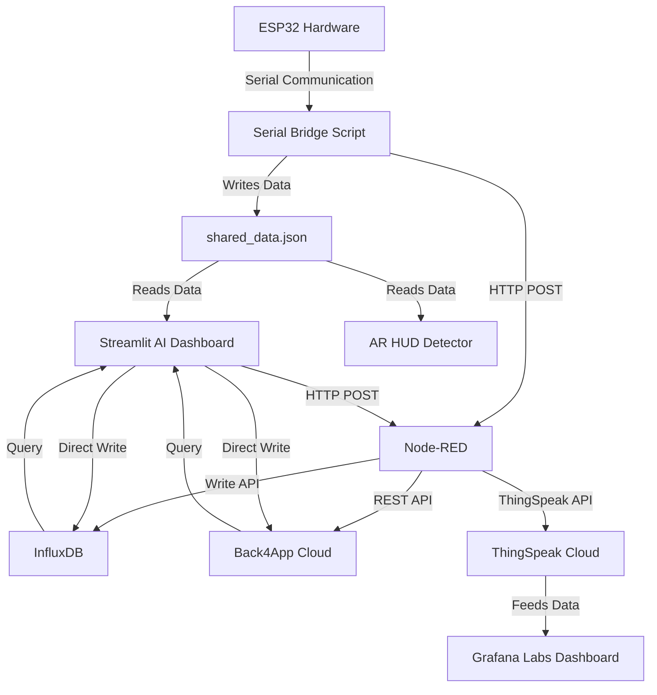

# Machine Health Monitoring System — Project Explanation

This project implements a multi-modal, end-to-end **Predictive Maintenance and Machine Health Monitoring System**. It leverages hardware sensors (via ESP32), local machine learning models (PyTorch & Scikit-Learn), real-time visualization (Streamlit dashboard & AR detector), and a multi-platform cloud backend (Node-RED, InfluxDB, Back4App, ThingSpeak & Grafana Labs).

---

## 1. System Architecture

The overall pipeline of the system is structured as follows:



1. **ESP32 Node**: Reads real-time data from sensors (MLX90614 Infrared Temperature Sensor, ACS712 Current Sensor) and communicates over serial to the PC.
2. **Serial Bridge (`serial_bridge.py`)**: Reads, parses, and buffers the raw telemetry and vibration data. It then writes it to `shared_data.json` and pushes telemetry to Node-RED.
3. **Node-RED**: Flow-based IoT middleware that receives telemetry and routes it to InfluxDB (time-series storage), Back4App (event logging), and ThingSpeak (legacy cloud) using visual flow programming.
4. **InfluxDB 2.x**: Purpose-built time-series database for high-performance storage and querying of all sensor telemetry. Provides 24-hour historical analytics, statistics, and trend visualization directly in the dashboard.
5. **Back4App (Parse Server)**: Cloud Backend-as-a-Service that stores machine fault events (`MachineEvent` class) and maintenance logs (`MaintenanceLog` class). Provides REST API for querying event history.
6. **Streamlit AI Dashboard (`dashboard.py`)**: Reads the live JSON file, feeds the metrics to the local machine learning models for real-time predictions, updates visualizations, and syncs the data to all cloud backends. Includes historical analytics from InfluxDB and event logs from Back4App.
7. **AR HUD Detector (`detector.py`)**: Runs OpenCV-based computer vision tracking to display a real-time Augmented Reality overlay on top of the machinery.
8. **ThingSpeak Cloud & Grafana Labs**: Serves as the legacy cloud backend, storing historic feeds and providing state-of-the-art telemetry visualization from anywhere in the world.

---

## 2. Multi-Modal Machine Learning Architecture

The core AI engine uses a **late-fusion model** architecture to achieve high diagnostic reliability:

```
                  ┌───────────────┐
vibration buffer ─┤  1D-CNN (Py)  ├─► cnn_prob ─┐
                  └───────────────┘             │   ┌─────────────────────┐
                                                ├──►│ Logistic Regression ├─► FUSED STATUS
                  ┌───────────────┐             │   │    (Meta-Learner)   │
 telemetry data  ─┤ Random Forest ├─► rf_prob  ─┘   └─────────────────────┘
                  └───────────────┘
```

### A. Vibration Branch (PyTorch 1D-CNN)
- **Model**: [HealthMonitor1DCNN](file:///b:/2nd_Semester_EL/model_utils.py#L42-L86)
- **Purpose**: Classifies complex physical vibration signals. It processes a sliding window of $100 \times 3$ vibration channels.
- **Why Convolutional**: Conv1D filters extract local micro-patterns (e.g. bearing defect frequencies and impact spikes) directly from the raw time-series data.

### B. Telemetry Branch (Scikit-Learn Random Forest)
- **Model**: Scikit-Learn `RandomForestClassifier` trained on the standard AI4I 2020 predictive maintenance dataset.
- **Purpose**: Processes tabular metrics: Temperature, RPM, Torque, and Tool Wear.
- **Derived Features**: Captures domain physics such as temperature delta (process temp vs. ambient temp) and tool wear load (tool wear $\times$ torque).

### C. Fusion Layer (Logistic Regression Meta-Learner)
- **Model**: `LogisticRegression`
- **Purpose**: Rather than choosing one model or running a simple average, the meta-learner learns custom weights for the probability outputs from the RF and CNN. This prevents false positives and ensures a correct verdict even if only one modality exhibits symptoms (e.g. overheating without vibrating, or vibrating without overheating).

---

## 3. Real-Time Frontends

### A. Local Streamlit Dashboard (`dashboard.py`)
- Real-time visualizations of 3-axis vibration signals using Plotly.
- Real-time gauge metrics for Fused AI confidence, CNN prediction, RF prediction, live temperatures, and current.
- **Battery Management System**: Simulates battery discharge curves based on the motor's live current draw and allows resetting the capacity.
- **Fault Injection Control Panel**: Allows simulating custom mechanical failures (Vibration, Temperature, or RPM faults) to test the robustness of the AI.
- **Historical Analytics**: 24-hour trend charts and statistics powered by InfluxDB queries.
- **Cloud Event Log**: Real-time table of fault events and maintenance records from Back4App.

### B. Cloud Frontends (ThingSpeak + Grafana)
- **ThingSpeak Client**: Integrated via [cloud_manager.py](file:///b:/2nd_Semester_EL/cloud_manager.py). It pushes updates to the cloud at a controlled 15-second interval.
- **Grafana Cloud**: Configured to query ThingSpeak's JSON endpoint directly via the **Infinity Datasource** to construct premium graphs, time-series, and stat dials for remote monitoring.

---

## 4. IoT Middleware & Cloud Backends

### A. Node-RED ([nodered_flows.json](file:///b:/2nd_Semester_EL/nodered_flows.json))
- **Role**: Flow-based IoT middleware for visual data routing and rule-based alerting.
- **Endpoints**:
  - `POST /api/telemetry` — receives sensor data from the serial bridge and dashboard
  - `POST /api/alert` — receives manual alerts from the dashboard
- **Routing**: Fans out incoming data to InfluxDB, Back4App, and ThingSpeak
- **Fault Rules**: Temperature threshold, overcurrent detection, AI probability threshold, low battery
- **Client**: [nodered_client.py](file:///b:/2nd_Semester_EL/nodered_client.py)

### B. InfluxDB 2.x ([influxdb_manager.py](file:///b:/2nd_Semester_EL/influxdb_manager.py))
- **Role**: Time-series database optimized for sensor telemetry storage and high-performance queries.
- **Measurement**: `machine_telemetry` with fields for temperature, current, vibration, RPM, battery, and AI probabilities.
- **Retention**: 30-day data retention policy.
- **Query Language**: Flux (InfluxDB 2.x native query language).
- **Dashboard Integration**: Provides 24h health history trends and min/max/mean statistics.

### C. Back4App / Parse Server ([back4app_manager.py](file:///b:/2nd_Semester_EL/back4app_manager.py))
- **Role**: Cloud BaaS for structured event logging and maintenance records.
- **Classes**:
  - `MachineEvent` — fault detections, temperature alerts, overcurrent alerts, low battery
  - `MaintenanceLog` — battery replacements, calibrations, system restarts
- **API**: Parse REST API (uses only Python stdlib `urllib`, no external dependencies).
- **Dashboard Integration**: Event log table and maintenance history in the Streamlit dashboard.

---

## 5. Infrastructure

### Docker Compose ([docker-compose.yml](file:///b:/2nd_Semester_EL/docker-compose.yml))
Single command to start both Node-RED and InfluxDB:
```bash
docker-compose up -d
```
- **Node-RED**: Port 1880, persistent flows in `./nodered_data/`
- **InfluxDB 2.x**: Port 8086, persistent data in `./influxdb_data/`

### Configuration Files
- [cloud_config.json](file:///b:/2nd_Semester_EL/cloud_config.json) — ThingSpeak API keys
- [integration_config.json](file:///b:/2nd_Semester_EL/integration_config.json) — Node-RED, InfluxDB, and Back4App configuration

### Setup Guide
See [nodered_setup.md](file:///b:/2nd_Semester_EL/nodered_setup.md) for complete setup instructions.
